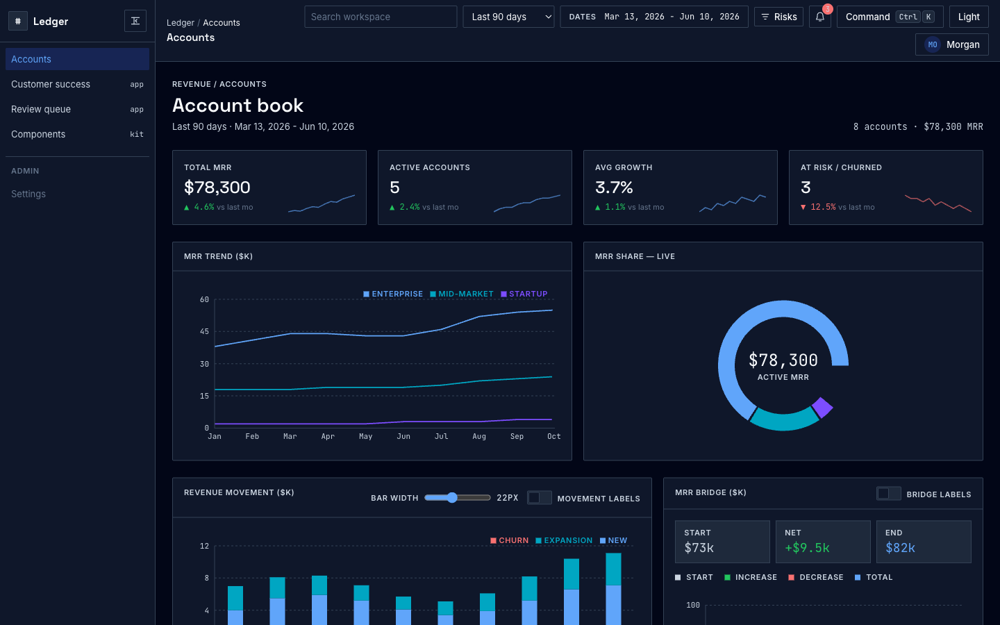
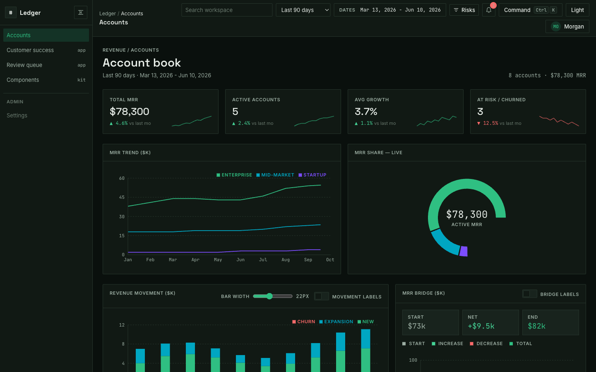
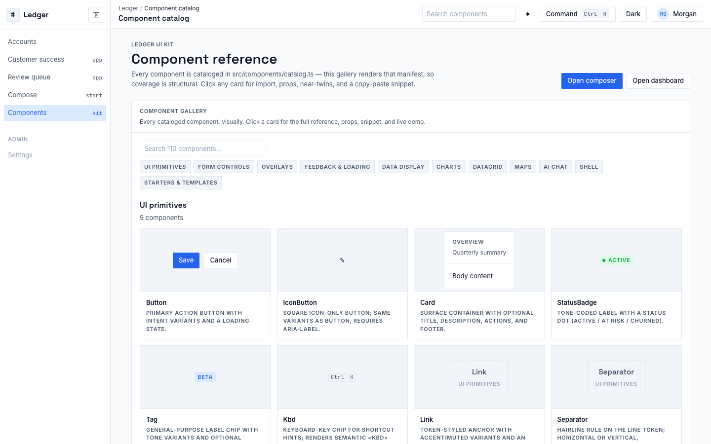
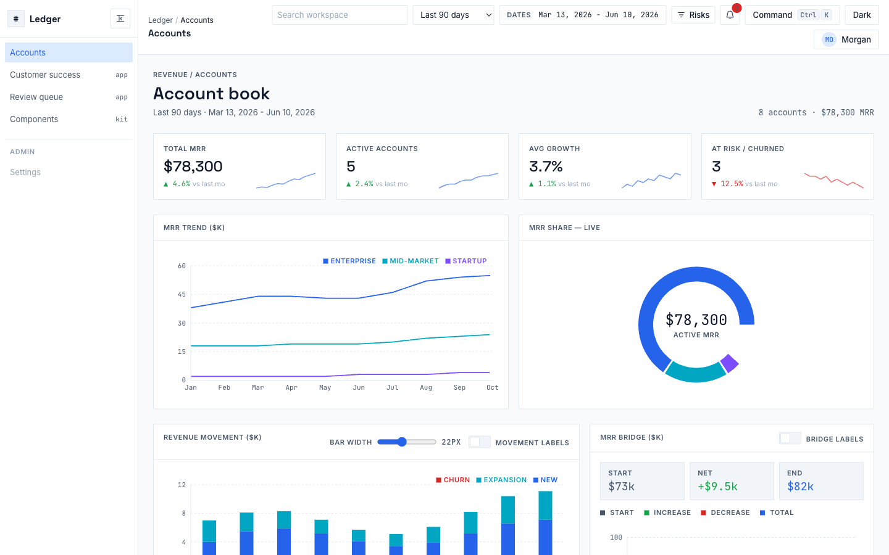
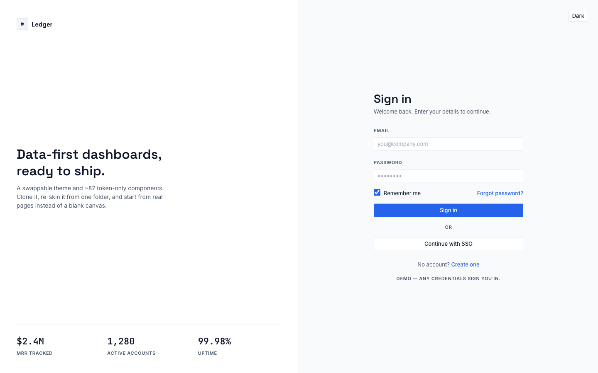
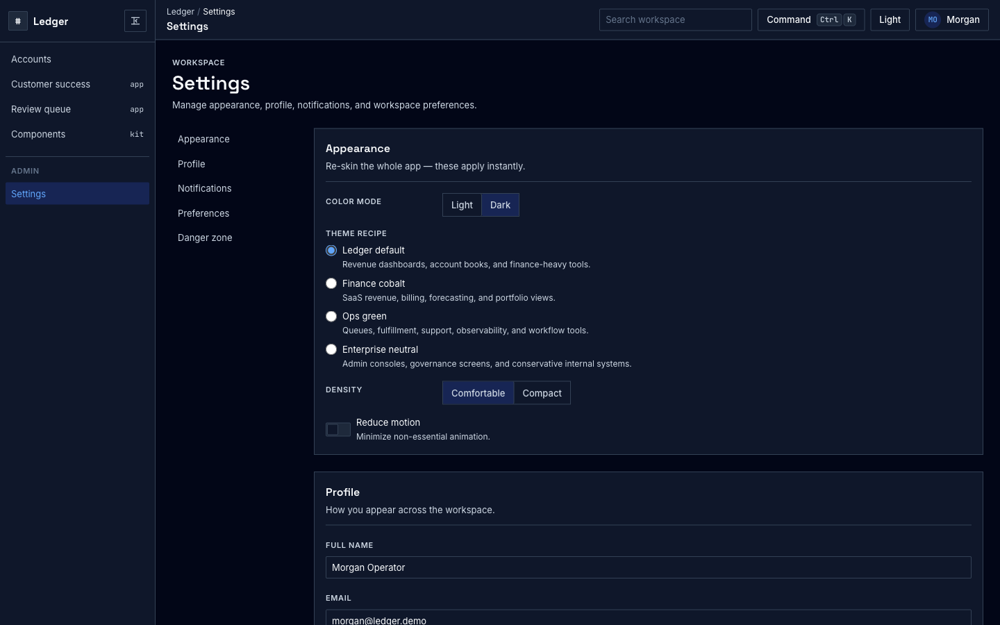

# parts-bin — React design system and component library

[](https://github.com/nathaniel-lyman/parts-bin/actions/workflows/ci.yml)
[](LICENSE)

A reusable React + TypeScript design system with token-only theming, UI primitives,
forms, overlays, feedback states, data display, DataGrid, charts, maps, shell/layout,
and chat primitives. The local Vite app exists to browse docs and examples.

**[Live demo →](https://nathaniel-lyman.github.io/parts-bin/)** · start with `/docs` for the component catalog, then explore the example dashboard, `/compose`, `/login`, `/settings`, and `/templates/*`.



**The whole skin lives in one folder.** Change `src/theme/tokens.css` (or apply a shipped
recipe) and every component, chart, and page re-skins — zero component edits, enforced by lint:

| parts-bin default | `ops-green` recipe — same app, one folder changed |
|---|---|
|  |  |

## Who is this for?

- **Product engineers** who need a copyable internal-app design system with a real public API.
- **Teams standardizing UI** across dashboards, admin tools, AI surfaces, and workflow apps.
- **Developers building examples fast** — the dashboard, composer, settings, sign-in, and template routes are proof surfaces built from the same components.

The account/MRR dashboard is intentionally demoted to example code. It demonstrates composition,
data derivation, and persistence, but it does not define the public component API.

## Quickstart
```bash
npm install
npm run dev
```

Starting a new project from this repo? Use GitHub's **"Use this template"** button (or clone and
delete `.git`) so you begin with a clean history.

**Primary surface: open [`/docs`](http://localhost:5173/docs).**
The docs catalog shows component purpose, imports, props, near-twin guidance, and snippets. Use
the dashboard, composer, and templates only as examples after selecting components.

## Your first 30 minutes

The fastest path from clone to using the design system:

1. **Browse `/docs`** and pick components from the catalog rather than deep files.
2. **Copy the design-system layers** you need: `src/theme/`, `src/components/ui/`, `shell/`, `DataGrid/`, `charts/`, `maps/`, and `chat/`.
3. **Re-skin through tokens** in `src/theme/tokens.css`; do not hardcode colors in components.
4. **Use examples as references**: `/` for a dashboard composition, `/compose` for a generated route plan, and `/templates/*` for full-page workflow examples.
5. **Verify** with `npm run lint`, `npm run lint:theme`, `npm run build`, and `npm test`.

Nothing in the framework is tied to the SaaS demo domain — it's one mapping away from yours:

| Shipped SaaS demo | Grocery store performance | Supplier scorecard |
|---|---|---|
| Account — name, owner | Store — number, district manager | Supplier — vendor, buyer |
| MRR | Weekly net sales | On-time fill rate (%) |
| Segment: Enterprise / Mid-market / Startup | Division or store format | Category: produce / dairy / dry goods |
| Status: Active / At risk / Churned | On-target / Below target / Remodel | Compliant / Watch / Suspended |
| Growth % | Comp sales growth | Fill-rate trend |

For the optional account-dashboard example, alternate domains exist as typechecked reference files —
[`src/data/examples/grocery-stores.ts`](src/data/examples/grocery-stores.ts) and
[`src/data/examples/supplier-scorecard.ts`](src/data/examples/supplier-scorecard.ts) — showing
the example's types, seed rows, and chart series remapped, plus the selector semantics you'd need
to decide. The mechanics of the swap — types, seed data, selectors, grid columns, in dependency
order — are written down in [`skills/swap-data-domain/SKILL.md`](skills/swap-data-domain/SKILL.md).

## Pages out of the box

The sample surfaces are built from the design system and live in the docs/examples app. Start at
**`/docs`** for the library reference:

| | |
|---|---|
|  **`/docs`** — live gallery/reference for the public component API |  **`/`** — example KPI + charts + DataGrid dashboard |
|  **`/login`** — example split brand-panel sign-in |  **`/settings`** — example appearance/profile/preferences page |

Workflow starter routes are included too: **`/templates/customer-success`** for an account-health console and
**`/templates/recommendation-review`** for a queue/detail review surface.

## What's inside
- **`src/theme/`** — the entire design system (tokens, fonts, base styles, Tailwind mapping,
  chart styling, and optional theme recipes). This is the swappable, portable layer.
  See `src/theme/RETHEME.md`.
- **`src/components/ui/`** — hand-rolled, token-only primitives exported from
  `src/components/ui`: buttons (with loading state), icon buttons, forms, comboboxes, radio groups,
  tabs, segmented controls, overlays (modal + drawer), inline alerts, cards, metrics,
  empty/loading states, spinners, pagination, and toasts.
- **`src/components/shell/`** — clone-ready app structure: app shell, sidebar, top nav,
  breadcrumbs, filter bars, section headers, and settings panels.
- **`src/components/`** — public design-system components and barrels: UI, shell, charts, maps,
  DataGrid, chat, KPI cards, sparkline, and confirm dialog. Demo-only account/template code is
  not exported from the aggregate component API.
- **`src/components/chat/`** — a composable assistant panel with markdown messages, prompt chips,
  streaming state, and a demo adapter that can read the current screen context.
- **`src/components/templates/`** — example full-page starters you can route to directly: a guided
  **App composer** (`/compose`), a dashboard, two workflow consoles, plus a split brand-panel
  **Login** (`/login`) and a section-scroll **Settings** (`/settings`) page. The starter pages
  are presentational demos — Settings' Appearance section is the live home for color mode,
  theme recipe, and density.
- **`src/hooks/`, `src/selectors/`, `src/data/`** — client-side state, derived metrics, seed data.
- **`/docs`** — live component catalog with examples, prop guidance, and copy-paste usage snippets.
- **`/compose`** — example admin-app composer that generates route, import, data-mapping, and theme snippets.
- **`skills/`** — agent skills: step-by-step workflows for re-theming, swapping the data domain,
  adding components, and verifying changes. See [Agent skills](#agent-skills).
- **`THEME-SPEC.md`** — the canonical design reference.

## Agent skills

The repo ships executable workflows for AI coding agents (Claude Code, Cursor, Codex, …), so the
happy path after cloning is: tell your agent *"re-skin this to my brand"*, then *"replace the demo
data with my domain"* — and it follows a checked-in, verified procedure instead of guessing.

| Skill | What your agent can do with it |
|---|---|
| [`retheme`](skills/retheme/SKILL.md) | Re-skin to a new brand — colors, dark mode, radii, fonts, chart palette |
| [`swap-data-domain`](skills/swap-data-domain/SKILL.md) | Optional example-dashboard workflow: replace the demo accounts/MRR data with another domain |
| [`add-component`](skills/add-component/SKILL.md) | Add UI the right way: catalog-first, token-only styling |
| [`verify-changes`](skills/verify-changes/SKILL.md) | Run the full done-checklist, including the failures tests alone miss |

Skills are plain markdown in the open Agent Skills format (`skills/<name>/SKILL.md`). Claude Code
picks them up automatically via `.claude/skills/`; other tools find them through
[AGENTS.md](AGENTS.md).

## Scripts
| Command | Does |
|---|---|
| `npm run dev` | start the app |
| `npm run build` | typecheck + production build |
| `npm run test` | run the Vitest suite |
| `npm run lint:theme` | fail if raw colors leak outside `src/theme/` |
| `npm run test:e2e` | run Playwright checks for layout-sensitive flows |

## Use parts-bin in an existing app
Copy-paste checklist (clone what you need, in order):
- [ ] **Theme** — copy `src/theme/` and import `theme/theme.css` at your root. Re-skin via `tokens.css` only.
- [ ] **Primitives** — copy `src/components/ui/`; import from the `ui` barrel (`Button`, `Field`, `Drawer`,
  `IconButton`, `InlineAlert`, `SegmentedControl`, modals, tabs, toasts, …).
- [ ] **Shell** — copy `src/components/shell/` for the app shell, sidebar, top nav, and filter bars.
- [ ] **Charts & DataGrid** *(optional)* — copy `src/components/charts/` and `src/components/DataGrid/`;
  import from the `charts` and `DataGrid` barrels.
- [ ] **Examples** — consult `/`, `/compose`, and `/templates/*` only as reference assemblies.
- [ ] **Boundary** — copy `scripts/lint-theme.mjs` and wire `npm run lint:theme` so raw colors never leak
  outside `src/theme/`.
- [ ] **Reference** — see `src/theme/RETHEME.md` to re-skin and `THEME-SPEC.md` for the canonical design spec.

Every design-system subsystem has a barrel (`ui`, `shell`, `charts`, `maps`, `DataGrid`, `chat`),
and `src/components` re-exports the reusable public surface as one aggregate import root. Import
from a barrel, not a deep file path:
```ts
import { Button, DataGrid, WaterfallChart, KpiCard } from './components'
```

parts-bin is intentionally a copy-paste kit first, not an npm package. Let the public API harden
across real cloned apps before packaging it.

## Theme recipes
Open `/docs` to preview and apply `finance-cobalt`, `ops-green`, and `enterprise-neutral`.
Recipes live in `src/theme/recipes.css`; the helper API lives in `src/theme/recipes.ts`.
The default theme maps primary action, recommendation intelligence, success, review, and
reject/blocker states to `--accent`, `--intel`, `--pos`, `--warn`, and `--neg`.

## Tech
Vite · React · TypeScript · Tailwind CSS v4 · Recharts · TanStack Table · Playwright · Vitest
